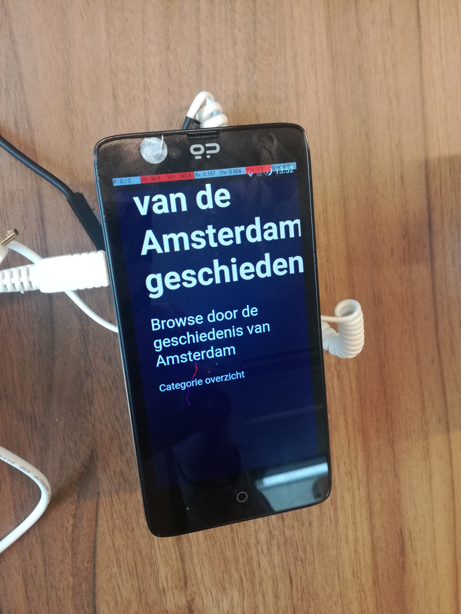
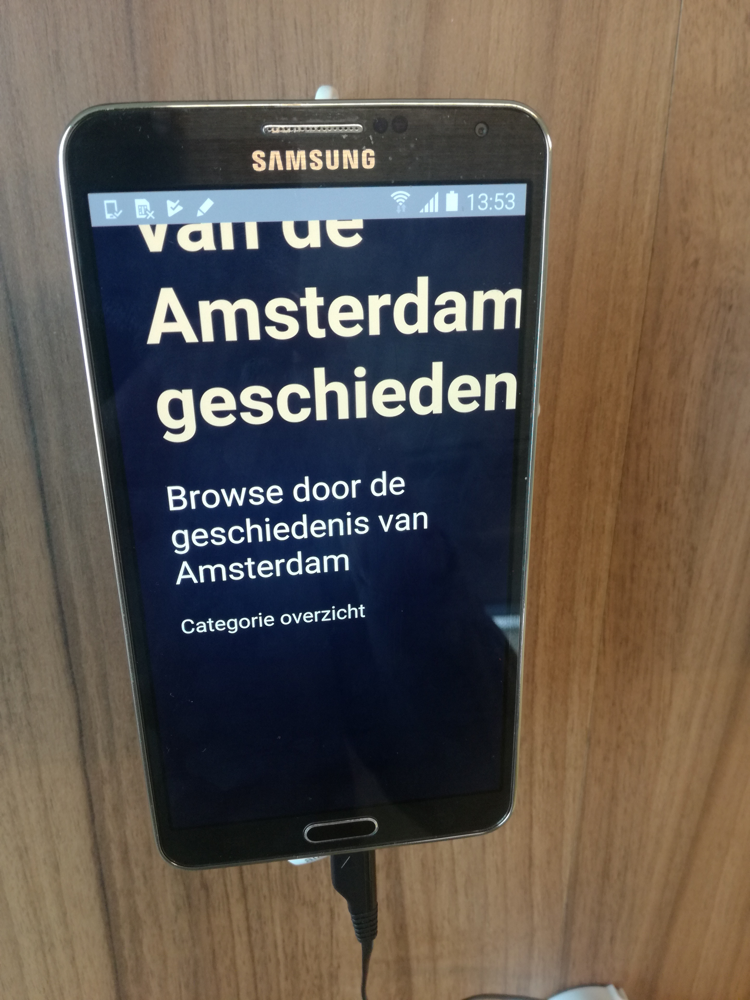
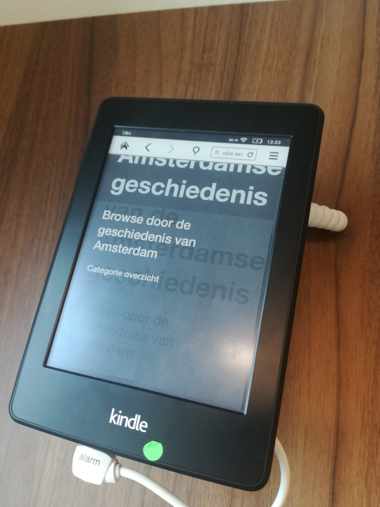
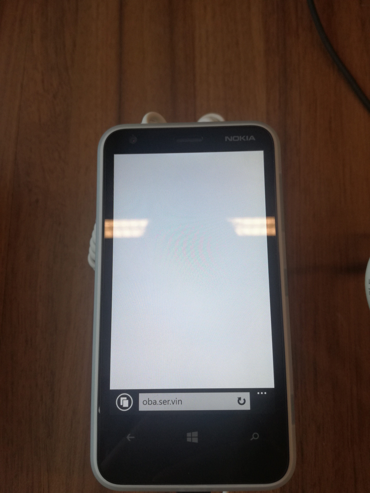

# Browser Technologies
//Robuuste, toegankelijke websites leren bouwen …

## Opdracht 1 - Progressive Enhancement

### Opdracht 1.1 - Breek het Web
Het Web laten 'breken' door features van het platform bewust uit te zetten. Images, custom fonts, JavaScript, kleur, breedband internet, etc. Allemaal met als doel je te laten beseffen hoeveel je nog niet weet van het Web, erachter komen dat je misschien aannames hebt die niet kloppen, en om je je in te laten leven in de eindgebruiker.

Onderzoek minimaal twee features. Dat betekent uitvogelen wat het voor impact heeft op de sites die je kent en normaal gebruikt. Kies sites in je directe omgeving: van je werkgever, lokale vereniging, de cafetaria om de hoek, en/of eerdere projecten die je zelf gedaan hebt.

Kies 2 features van de 8
- Zoek uit welke problemen ze kunnen veroorzaken (verzamel cijfers, meningen, ervaringen)
- Zoek uit hoe je dit kunt testen (hoe kun je een feature ‘uitzetten’)
- Vind een aantal sites waar dit ook problemen oplevert (uit je directe omgeving)
- Beschrijf hoe je dit kan fiksen
- Maak hierover een presentatie en neem die woensdag mee, dan gaan we de resultaten bespreken
Lezen: [Everyone has JavaScript, right?](https://kryogenix.org/code/browser/everyonehasjs.html) en [I Turned Off JavaScript and it was Glorious](https://www.wired.com/2015/11/i-turned-off-javascript-for-a-whole-week-and-it-was-glorious/)

### Opdracht 1.2 - Fork je OBA
Hoe zit het eigenlijk met Progressive Enhancement van je OBA opdracht? Waarschijnlijk kan daar wel het één en ander aan verbeterd worden, dat ding is immers in een week in elkaar gehackt!

Voor deze opdracht ga je toepassen wat je van opdracht 1.1 hebt geleerd.
- Pas Progressive enhancement toe op je OBA Web App.
- Check je OBA Web App op de 8 features uit opdracht 1.1 en verbeter de code waar mogelijk.
- Test  je OBA Web App in het device lab.
- Laat je OBA Web App voorlezen door een screenreader.
- Gebruik onderstaande artikelen om je code te optimaliseren.
[The accessibility mindset](https://24ways.org/2015/the-accessibility-mindset/) en [Accessibility Originates With UX: A BBC iPlayer Case Study](https://www.smashingmagazine.com/2015/02/bbc-iplayer-accessibility-case-study/)

Criteria
- Zet je code op Github
- Schrijf een Readme met een beschrijving van de problemen die je hebt gevonden, hoe je die hebt opgelost, of hoe je dit zou oplossen (met todo’s) als je genoeg tijd en budget zou hebben

### Opdracht 1.2 - bevindingen

Link naar Oba [repo]

Link naar Oba [project]

[repo]: https://github.com/servinlp/project1-quick-hack-prototype
[project]: http://oba.ser.vin/

- `localStorage`: Zonder `localStorage` werkt helemaal niks... Dit probleem komt doordat hij bij het ophalen van de data eerst kijkt of
  er iets in de `localStorage` staat voor hij een `fetch` gaat maken voor de data. Als `localStorage` dan niet
ondersteund wordt zal deze een error gooien waardoor de code die hierna komt (de `fetch` dus) niks meer gaat doen.
- Contrast: Contrast is bij beide tekst kleuren zeer goed. Een is wit op blauw/zwart, dus uitermaten goed. De andere combinatie is
  beige op blauw/zwart. Deze is qua contrast ietsjes minder dan wit op blauw/zwart maar alsnog zeer goed.
- Kleur: De website is gemaakt voor het weergeven van afbeeldingen met hierbij informatie over de afbeelding. Dankzij
  het contrast zal de tekst dus wel (bijna) altijd goed te lezen zijn. Aangezien de meeste foto's zwart/wit zullen zijn
zal dit in de meeste gevallen ook geen groot probleem zijn. Enigste wat een probleem kan worden zijn de recent gemaakte afbeeldingen die kleuren foto's zijn van objecten.
- Custom font: In het geval dat er het custom font niet kan worden ingeladen (Roboto van Google fonts) zal deze terug vallen op het
  systeem font. Hiervoor wordt de code voor de fallback fonts gebruikt van Github.

```
-apple-system, BlinkMacSystemFont, "Segoe UI", Roboto, Helvetica, Arial, sans-serif, "Apple Color\a Emoji", "Segoe UI Emoji", "Segoe UI Symbol"
```

- Foto's: De website is een catalogus voor de afbeeldingen vanuit de adamlink api. Afbeeldingen zijn dus het
  belangrijkste van de site. Zonder dit Heeft de site eigenlijk geen nut. Probleem is, het ophalen van de afbeeldingen
heb ik totaal niet in de hand. Als een afbeelding dus wel in de database staat maar niet meer op de server kan hij niks
inladen. Momenteel is hier ook nog geen controle voor dus dan laad hij gewoon een leeg vlak zien. Mogelijke "oplossing"
hiervoor is een fallback afbeelding voor het geval dat er geen afbeelding meer bestaat.
- Breedband internet: Doordat de site een single page application is (en dus ook alle HTML door JavaScript gerenderd
  wordt) zal er pas wat zichtbaar worden zodra de JavaScript is ingeladen. Dit betekend dat eerst de HTML ingeladen moet
worden, dan de CSS, dan de fonts, dan de JS en pas als deze uitgevoerd is zal er een eerste deel van de HTML zichtbaar worden. In
eerste instantie zal dit alleen de header worden. Hierna zal gekeken worden of er data opgehaald moet worden of niet en
als deze data binnen is kan hij pas de daadwerkelijke content inladen. Als dit alles gedaan is zullen de afbeeldingen
nog ingeladen moeten worden voordat de website klaar is met alles renderen.
- Cookies: Wordt niet gebruik gemaakt van. Dit zal de website dus ook niet slopen.
- Muis/Trackpad: Dankzij de wat simpele structuur van de site betekend dit dat er eigenlijk niks gedaan hoefde te worden
  om er voor te zorgen dat je makkelijk de site kan navigeren met behulp van tabben. Er is voor focus states ook niks
aangepast dus hierbij zal de default styling van de browser zichtbaar zijn.
- JavaScript: Aangezien de website een single page application is (en er niks server side gerendert wordt) zal de
  website zonder JavaScript helemaal niks doen. Er is ook niet is als een `noscript` tag aanwezig dus er zal echt
helemaal niks aangezig zijn. Hier zou dus iets als een `noscript` tag al een snelle winst zijn. De volgende stap zou dan
server side rendering zijn. Als dit geimplementeerd zou zijn zou de website al meteen werken zonder JavaScript.

### Opdracht 1.2 - Screen reader test

Een van de eerste dingen die opvallen is dat bij de categorie overzicht hij de categorien goed doet opnoemen maar hierna
komt het getal met het aantal entries binnen de categorie. Probleem is dat hij gewoon een categorie + getal op noemt
maar je eigenlijk nooit te horen krijgt wat het getal inhoud. Hierbij zou het dus netjes als je hoort wat het getal is.
Foto's aantal 169349 in plaats van Foto 169349.

In geval van de breadcrumb heb je eigenlijk ook het geval dat hij gewoon maar iets opnoemt maar je hier nergens hoort
wat het is. Hier zou dus iets van een beschrijving bij mogen wat dan alleen voor de blinde/slechtziende is. Voor de
"normale" gebruikers zal dit niet nodig zijn aangezien de visuele hint duidelijk maken wat het is.

### Opdracht 1.2 - ToDo:

- Check toevoegen of localStorage aanwezig is EN dat je ook kan schrijven.
- Voor fonts is het gebruik van `font-display: swap;` misschien wel aan te raden als het externe font niet beschrikbaar
  is. Dan laat hij de fallback fonts meteen zien. Dan maakt het dus niet veel uit of het font wel of niet laad. (En het
is een stuk sneller natuurlijk.)
- In geval van foto's kan het wel handig zijn om voor elke foto zijn ruimte al van te voren te "claimen". Dan zal je ook
  geen verschruiving van de content krijgen.
- Voor de snelheid van de website kan nog aardig wat getweakt worden. Niet persee grote dingen maar wel verbeteringen.
  (Er is tenslotte een reden dat we een heel vak hebben gericht op gebied van performance.)
- Om de website te laten werken zonder JavaScript zal de grootste uitdaging worden. En toch ook weer niet... Als de
  website al op de server gerenderd worden en dan samen met de data naar de client gestuurd kan worden is hij eigenlijk
al meteen progresive enhanced (op JavaScript gebied alleen dan). Nu is het laten renderen op de server hier voor nog wel
het grootste (maar alsnog goed te doen).

### Opdracht 1.2 - device lab

- `<script type='module'>` is leuk maar werkt hier op 1 telefoon. Oplossing is dan om met babel een build te maken en
  dit dan samen met de module versie in de code te plaatsen. En dan met gebruik van de `nomodule` tag op de `script`
tag.
- Laadtijd word hier ook een ding. De afbeeldingen die ingeladen worden zijn nou eenmaal groot. Probleem in deze
  situatie is dat deze vanuit de api komen en ik hier dus geen aanpassingen kan doen (of ik moet alles op een eigen
server opslaan, en dat gaan we niet doen).





