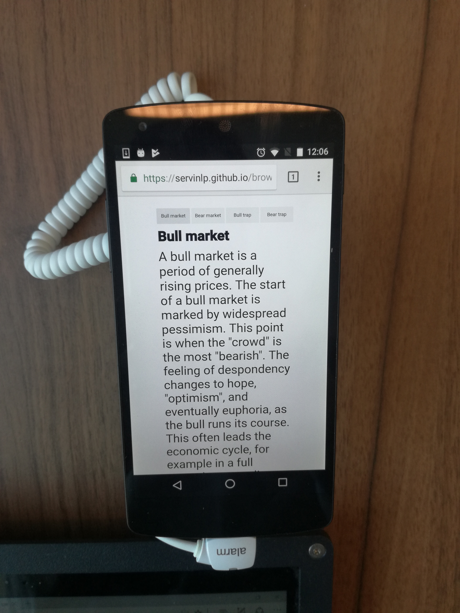
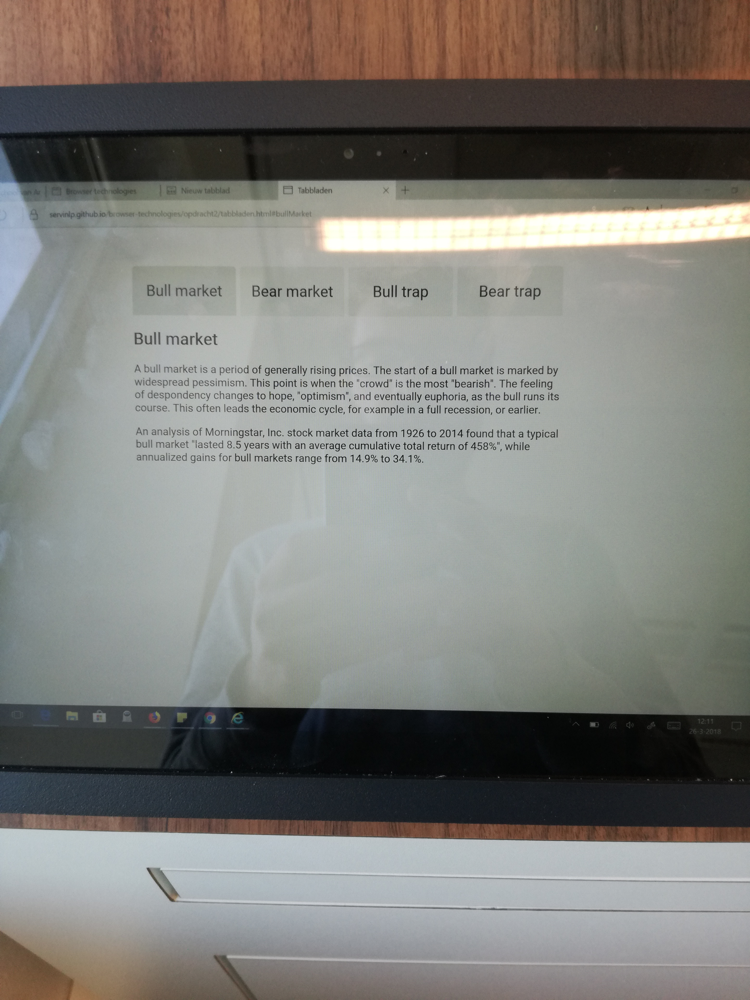
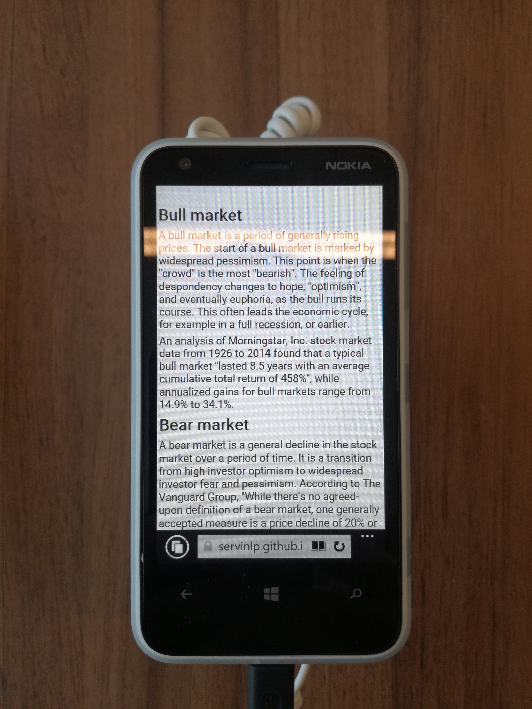
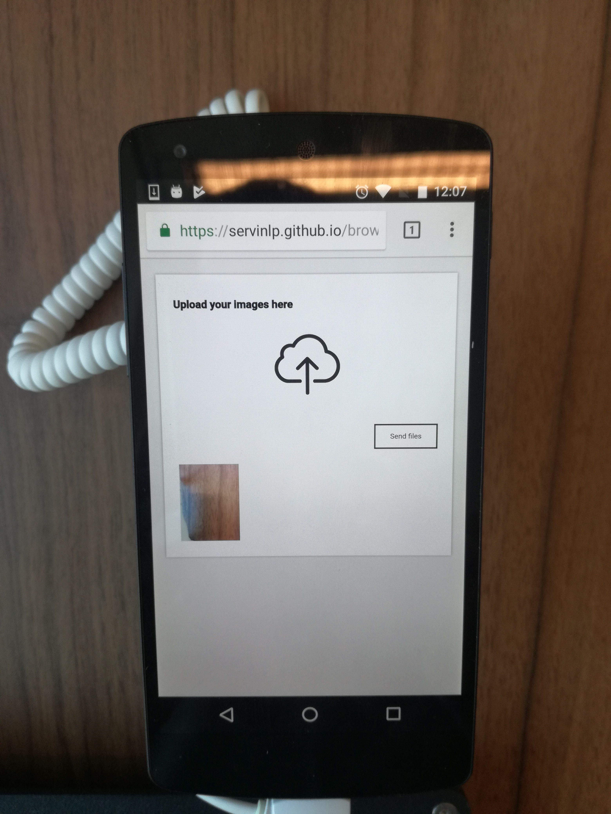
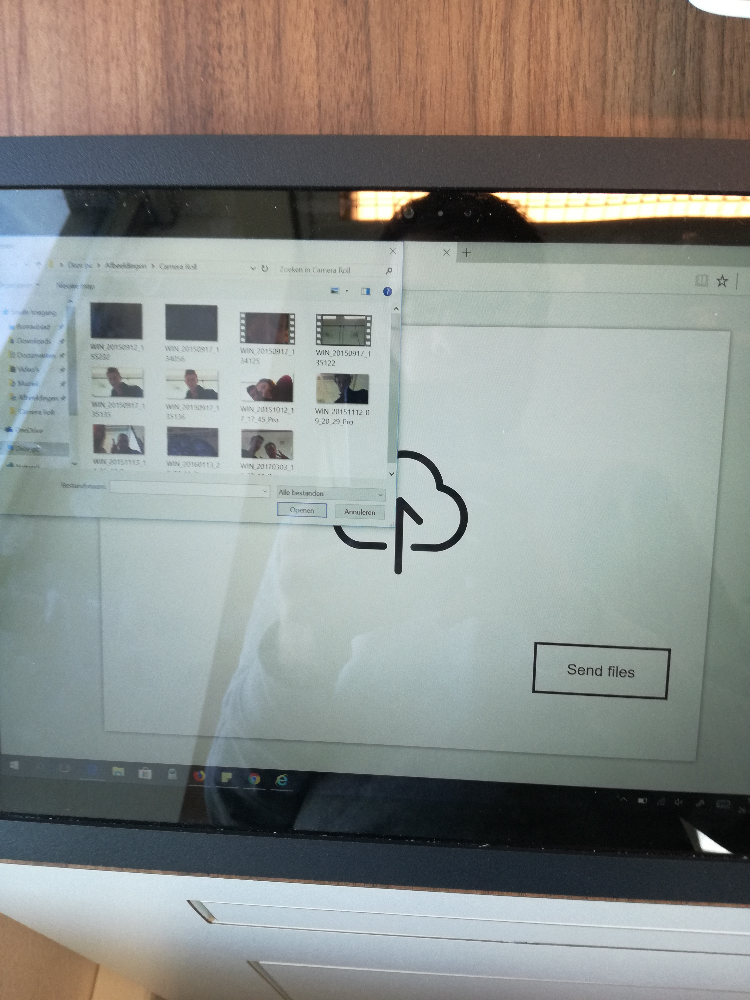
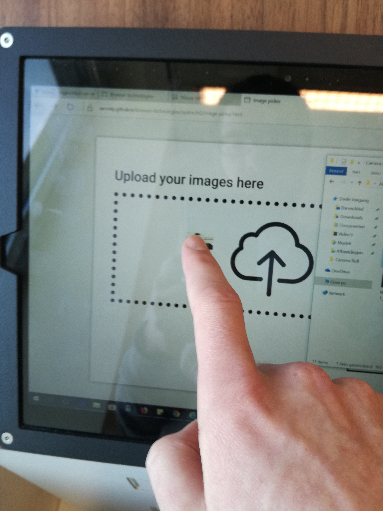
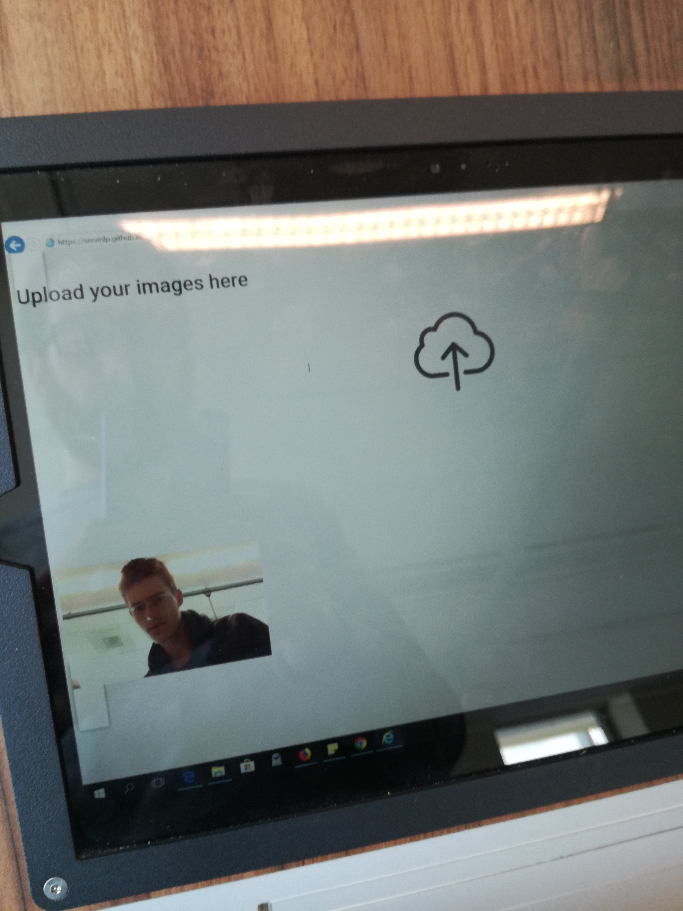
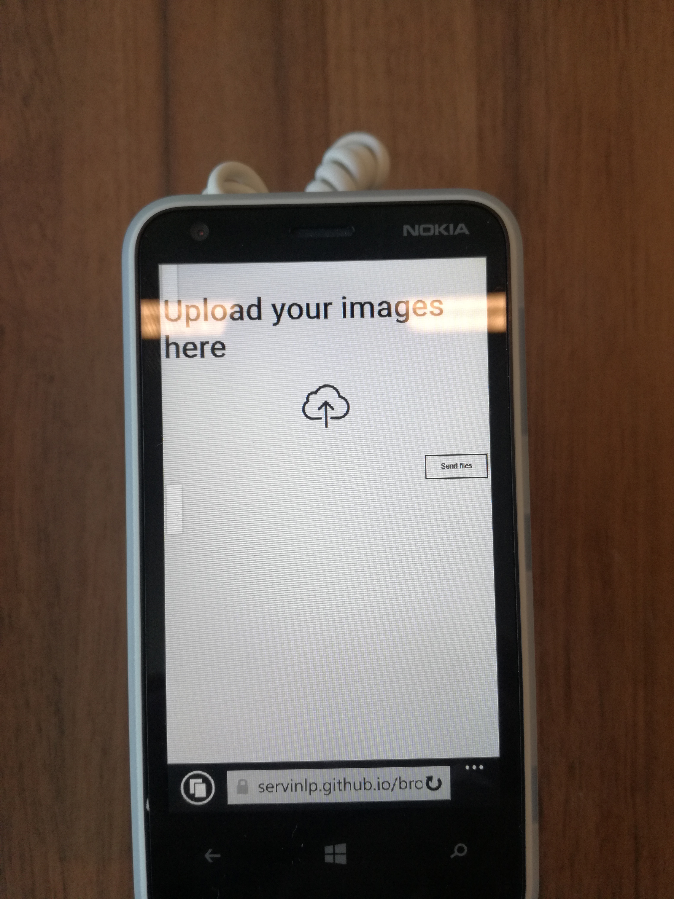

# Browser Technologies
//Robuuste, toegankelijke websites leren bouwen …

## Opdracht 2 - 1, 2, 3 Feature Detectie
Werk 2 componenten uit in een demo, waarbij je onderzoekt hoe verschillende features worden ondersteund en hoe je een goede fallback kan bouwen. Gebruik [html5test.com](html5test.com), [css3test.com](css3test.com) en [kangax.github.io/compat-table/es6/](kangax.github.io/compat-table/es6/])

- Per feature: Zoek uit hoe je deze kunt testen. Verzamel uitleg en artikelen. Bouw een (kleine) progressive enhanced demo (zonder extra tools, gewoon in 1 HTML file, zo simpel mogelijk). Test de feature (en fallback) op verschillende browsers en het Device Lab. Let op: Gebruik van polyfills is niet toegestaan.
- Post je 2 demo’s op GitHub met uitleg in een README file. Wat is de feature? Welke browsers/devices ondersteunen deze wel/niet? Hoe zorg je dat de fallback nuttig is?

criteria
- 2 componenten zijn onderzocht en er is een demo gemaakt.
- De code staat in een repository op GitHub.
- Een Readme is toegevoegd met, per feature:
  -	Een beschrijving van de feature.
  - Bronnen van uitleg en gebruikte artikelen.
  -	Welke browsers/devices ondersteunen deze wel/niet.
  -	Een beschrijving hoe de fallback werkt.

### Opdracht 2 - Tabbladen

De demo: [Tabbladen]

De demo is een voorbeeld van een simpel tabbladen layout. In zijn eerste level, zonder JavaScript of zonder CSS3, zal alle content uitgeklapt zijn. Zonder JavaScript kan je niet goed switchen van tabblad en is het dus beter om alle content gewoon meteen te laten zien. Door de in CSS op de article `:nth-of-type(n)` te plaatsen op de plek waar alle `article`'s op `display:none` gezet worden zal deze regel genegeerd worden zodra CSS3 dus niet ondersteund wordt. (`:nth-of-type()` is pas vanaf CSS3, zie [hier](https://caniuse.com/#search=nth-of-type))

Bij de JavaScript is er ook nog een check die kijkt of `querySelector` en `addEventListener` ondersteund worden. Anders zal de JavaScript niet geactiveerd worden (En dus weer alle content zichtbaar worden). Als er JavaScript aanwezig is zal ook de class `no-js` van de body verwijdert worden. De styles die aan deze class gekoppeld is zijn alleen van toepassing als JavaScript uitstaat/niet ondersteund wordt.

[Tabbladen]: https://servinlp.github.io/browser-technologies/opdracht2/tabbladen.html

**Waarom niet gewoon met de input hack?**

Dit zou inderdaad een goede oplossing zijn om het gewenste gedrag te krijgen zonder ook maar iets van JavaScript te gebruiken. Maar er is een reden dat dit als hack gezien wordt.

Ook al werkt het, je bent wel elementen aan het misbruiken voor een doeleinde waar het eigenlijk nooit voor bedoelt was. Het is dus leuk om mee te spelen en te weten dat het kan. Maar bij echt gebruik in productie wil je het misschien niet gebruiken.

Voor screen readers is deze manier ook eerder slechter. Zij horen op een plek waar ze navigatie verwachten opeens dat ze zomaar een `input` element krijgen. En waarschijnlijk ook nog zonder goede beschrijving van waar dit element voor is.

Kort om, het is een en al verwarring en misbruik. (+ het gebruik van JavaScript is niet erg.)

**Screen reader test**

Bij de eerste versie gebruikte in nog de input checked hack. Dit werkt natuurlijk heel mooi maar voor een screen reader
lijkt het alsof je opeens in een formulier bent beland in plaats van dat het navigatie is. Dit is hierna aangepast naar
buttons. Dit was beter maar kon nog optimaler. Voor een screen reader was dit al oke maar het is logiser als dit gewoon
een `a` tag is. Dan kan je zonder JavaScript namelijk de navigatie ook nog gebruiken.

**Device lab**

Device lab afbeeldingen

### Opdracht 2 - Image picker

De demo: [Image picker]

Een "simpele" afbeelding picker/uploader. In geval van de meest simpele versie zal je alleen een input veld zien voor
een bestand met een verzend knop. Zodra dingen als SVG, JavaScript en CSS ondersteund en aan hebt staan zal je foto's
kunnen selecteren door op het icoon te klikken. Na het selecteren zal je dan kunnen zien hoeveel bestanden er
geselecteerd zijn. Een stap verder is om de geselecteerde afbeeldingen weer te geven zodat je nog even ziet wij je aan
het uploaden bent. Als laatste toevoegen kan je ook nog als drag en drop je bestanden er in gooien en zal je hier ook
feedback over krijgen.

**Screen reader test**

Ook al wordt de demo uitgebreid door de JavaScript die er aan toegevoegd wordt, de basis (HTML) is vrij simpel. Het
bestaat uit een titel, label met input element en een submit button. Hier gaat dus niet heel veel mis.

**Device lab**

Device lab afbeeldingen

[Image picker]: https://servinlp.github.io/browser-technologies/opdracht2/image-picker.html
